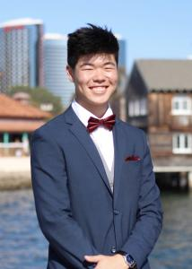

# Hello, my name is Wesley Wang



>Computer Engineering at **UCSD**

```console.log('Ascend Learning Intern');```

Hi, my name is welsey and I am a third year at UCSD. I am a very active person who enjoys playing sports, namely basketball, volleyball, and badminton. I am looking forward to this class as a more open ended approach to not only learning new technologies to code with, but also gather some insight into the process of the development of that code. I hope to learn from the more collaborative and open ended structure that this class follows as opposed to those more common in traditional academia. I hope to gain experiences that mimic the internship I had and am currently continuing. 

Link to my [personal website](https://wesley-t-wang.github.io/WesleyWangSWE/#intro)

[I like to play volleyball](hit.jpg)

Hobbies
- Volleyball
- Building Keyboards
- Basketball
- Lifting
- Video games
- Anime

Favorite NBA Teams
1. Denver Nuggets
   - Jamal Murray
   - Jokic
   - MPJ
2. Chicago Bulls
   - Demar Derozan
   - Zach Lavine